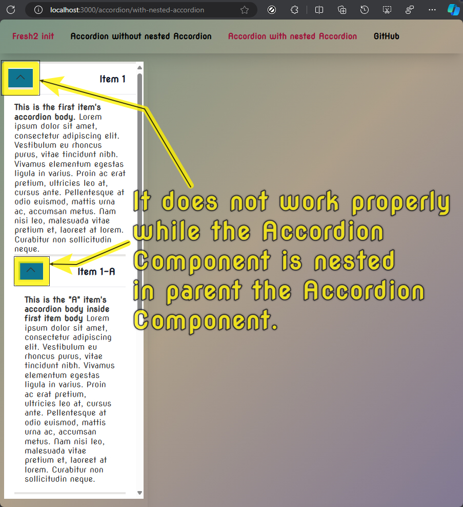
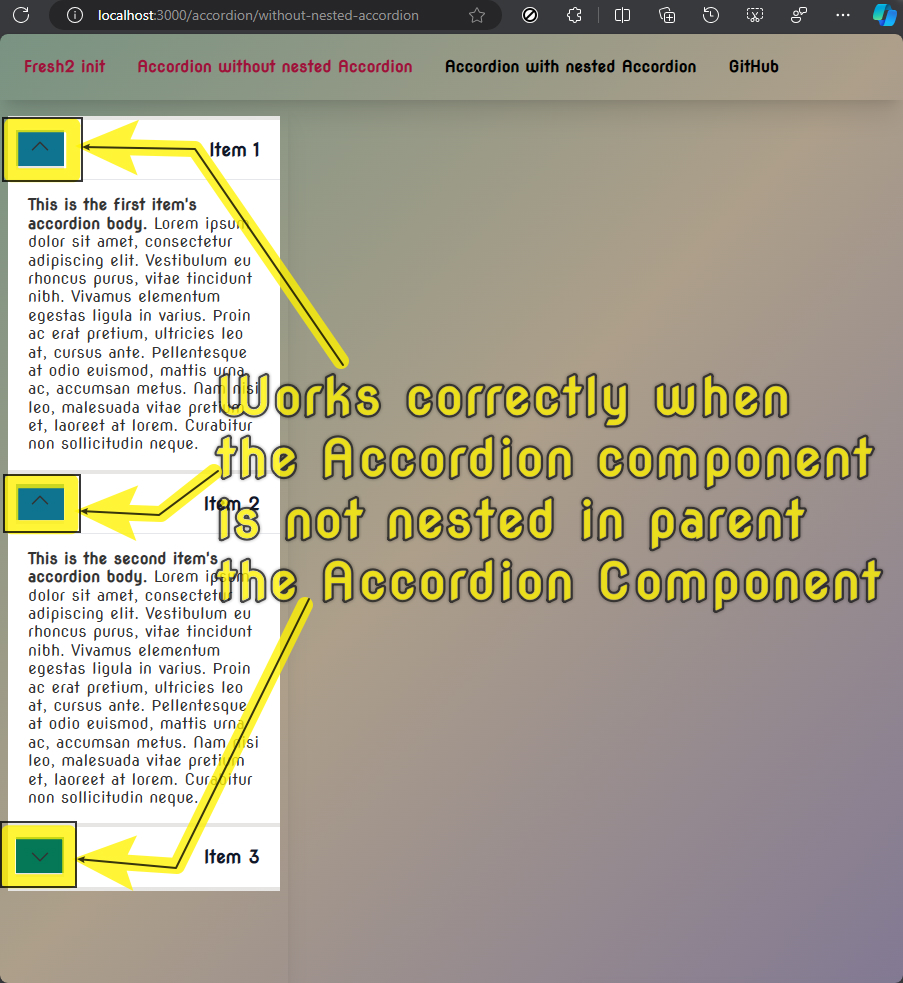

# deno fresh ...

> 
> ```PowerShell
> run -Ar jsr:@fresh/init@2.0.0-alpha.16
> ```
>
> ### deno tasks
>
> - ` deno task check ` => `deno fmt --check && deno lint && deno check **/*.ts && deno check **/*.tsx`
> - ` deno task dev ` => `deno run -A --watch=static/,routes/ dev.ts`
> - ` deno task build ` => `deno run -A dev.ts build`
> - ` deno task start ` => `deno run -A main.ts`
> - ` deno task update ` => `deno run -A -r jsr:@fresh/update .`
> 

---

# **deno fresh error: not working nested islands**

- [**GitHub Code of** "deno fresh error: not working nested islands"](https://github.com/j-Cis/deno-fresh-error-notworking-nested-islands)
- [**GithHub View (by Deno Deploy) of** "deno fresh error: not working nested islands"](https://deno-fresh2-errors.deno.dev/)
- [**Deno Deploy of** "deno fresh error: not working nested islands"](https://dash.deno.com/projects/deno-fresh2-errors)
- [**Deno Deploy process of** "deno fresh error: not working nested islands"](https://dash.deno.com/projects/deno-fresh2-errors/in_progress)

---
---

## **1 :** `./components/AccordionContainer.tsx`.

> ```TSX
> import { ComponentChildren, h } from "preact";
> 
> interface AccordionContainerProps {
>   children: ComponentChildren;
> }
> 
> export default function AccordionContainer(props: AccordionContainerProps): h.JSX.Element {
>   return (
>     <div 
>       class={[
>         "rounded-none border border-l-0 border-r-0 border-b-0",
>         "bg-white dark:bg-neutral-800",
>         "border-t-4 border-t-stone-200"
>       ].join(" ")}
>     >
>       {props.children}
>     </div>
>   );
> }
> ```

---

## **2 :** `./islands/AccordionItem.tsx`.

> ```TSX
> import type { Signal } from "@preact/signals";
> import { ComponentChildren, h } from "preact";
> 
> interface AccordionItemProps {
>   children: ComponentChildren;
>   label: string;
>   labelIsLink?:boolean;
>   href?:string;
>   show: Signal<boolean>;
> }
> 
> export default function AccordionItem(props: AccordionItemProps): h.JSX.Element {
>   return (
>     <div class=" flex flex-col flex-1 flex-nowrap">
>       <div 
>         class={[
>           "flex flex-row flex-nowrap",
>           "justify-between",
>           "mb-0",
>           props.show.value && "[box-shadow:inset_0_-1px_0_rgba(229,231,235)] dark:[box-shadow:inset_0_-1px_0_rgba(75,85,99)]",
>           !props.show.value && "border-b-4 border-b-stone-200"
>         ].join(" ")}
>       >        
>         <div class="flex flex-col flex-nowrap justify-center px-2">
>           <button 
>             class={[
>               "box-border size-10  border-b-4 border-b-stone-200",
>               props.show.value ? "bg-cyan-700 px-[16px]" : "bg-emerald-700 pr-[16px] pl-[12px]",
>               "flex w-full items-center",
>               "transition [overflow-anchor:none] hover:z-[2] focus:z-[3] focus:outline-none"
>             ].join(" ")}
>             onClick={() => props.show.value = !props.show.value}
>             type="button"
>             aria-expanded="true"
>             aria-controls="collapseOne"
>           >
>             <span
>               class={[
>                 props.show.value 
>                   ? "rotate-[-180deg] -mr-1"
>                   : "rotate-0 fill-[#212529] dark:fill-white",
>                 "ml-auto h-5 w-5 shrink-0 fill-[#336dec] transition-transform duration-200",
>                 "ease-in-out motion-reduce:transition-none dark:fill-blue-300"
>               ].join(" ")}
>             >
>               <svg
>                 xmlns="http://www.w3.org/2000/svg"
>                 fill="none"
>                 view-box="0 0 24 24"
>                 stroke-width="1.5"
>                 stroke="currentColor"
>                 class="h-6 w-6"
>               >
>                 <path
>                   stroke-linecap="round"
>                   stroke-linejoin="round"
>                   d="M19.5 8.25l-7.5 7.5-7.5-7.5"
>                 />
>               </svg>
>             </span>
>           </button>     
>         </div>    
>         <h2 class={[
>           "text-wrap text-lg px-5 py-4 text-left  font-bold text-gray-900",
>           props.labelIsLink && "hover:text-gray-600 hover:underline hover:decoration-double hover:decoration-2",
>           props.labelIsLink
>             ? props.show.value ? "hover:decoration-cyan-700" : "hover:decoration-emerald-700"
>             : "",
>           props.labelIsLink && "aria-[current]:text-green-700 aria-[current]:underline aria-[current]:decoration-double aria-[current]:decoration-4"
>         ].join(" ")}>
>           {props.labelIsLink && <a href={props.href ?? ""} > {` ${props.label} `} </a> }
>           {!props.labelIsLink && <>{` ${props.label} `}</>}          
>         </h2>
>       </div>
>       {props.show.value && <div class="!mt-0 !rounded-b-none !shadow-none border-b-4 border-b-stone-200">
>           <div class="px-5 py-4">
>             {props.children}
>           </div>
>         </div>
>       }
>     </div>
>   );
> }
> ```

---

## **A :**  It does not work properly while the Accordion Component is nested in parent element of the Accordion Component.

> 
> 
> 
> ### `./routes/accordion/with-nested-accordion.tsx`
>
> ```TSX
> import { useSignal } from "@preact/signals";
> import define from "$utils/fresh.ts";
> import Layout from "$components/Layout.tsx";
> import AccordionItem from "$islands/AccordionItem.tsx";
> import AccordionContainer from "$components/AccordionContainer.tsx";
> 
> export default define.page(function PageAccordionWithNestedAccordion(/*{url}*/) {
>   
>   const showItem1 = useSignal(true);
>   const showItem1A = useSignal(true);
>   const showItem1B = useSignal(false);
>   const showItem1C = useSignal(false);
>   const showItem2 = useSignal(false);
>   const showItem2A = useSignal(false);
>   const showItem2B = useSignal(false);
>   const showItem3 = useSignal(false);
> 
> 
>   //console.log(url.pathname)
> 
>   return (
>     <Layout navShow={true} navActive="/accordion" asideShow={true} aside={
>         <AccordionContainer>
>           <AccordionItem label="Item 1" labelIsLink={true} href="" show={showItem1}>
>             <div>
>                   <strong>This is the first item's accordion body.</strong> Lorem
>                   ipsum dolor sit amet, consectetur adipiscing elit. Vestibulum eu
>                   rhoncus purus, vitae tincidunt nibh. Vivamus elementum egestas
>                   ligula in varius. Proin ac erat pretium, ultricies leo at, cursus
>                   ante. Pellentesque at odio euismod, mattis urna ac, accumsan
>                   metus. Nam nisi leo, malesuada vitae pretium et, laoreet at lorem.
>                   Curabitur non sollicitudin neque.
>             </div>
>             <AccordionContainer>
>               <AccordionItem label="Item 1-A"  show={showItem1A}>
>                 <div>
>                       <strong>This is the "A" item's accordion body inside first item body</strong> Lorem
>                       ipsum dolor sit amet, consectetur adipiscing elit. Vestibulum eu
>                       rhoncus purus, vitae tincidunt nibh. Vivamus elementum egestas
>                       ligula in varius. Proin ac erat pretium, ultricies leo at, cursus
>                       ante. Pellentesque at odio euismod, mattis urna ac, accumsan
>                       metus. Nam nisi leo, malesuada vitae pretium et, laoreet at lorem.
>                       Curabitur non sollicitudin neque.
>                 </div>
>               </AccordionItem>
>               <AccordionItem label="Item 1-B" labelIsLink={true} href="" show={showItem1B}>
>                 <div>
>                       <strong>This is the "B" item's accordion body inside first item body</strong> Lorem
>                       ipsum dolor sit amet, consectetur adipiscing elit. Vestibulum eu
>                       rhoncus purus, vitae tincidunt nibh. Vivamus elementum egestas
>                       ligula in varius. Proin ac erat pretium, ultricies leo at, cursus
>                       ante. Pellentesque at odio euismod, mattis urna ac, accumsan
>                       metus. Nam nisi leo, malesuada vitae pretium et, laoreet at lorem.
>                       Curabitur non sollicitudin neque.
>                 </div>
>               </AccordionItem>
>               <AccordionItem label="Item 1-C" show={showItem1C}>
>                 <div>
>                       <strong>This is the "C" item's accordion body inside first item body</strong> Lorem
>                       ipsum dolor sit amet, consectetur adipiscing elit. Vestibulum eu
>                       rhoncus purus, vitae tincidunt nibh. Vivamus elementum egestas
>                       ligula in varius. Proin ac erat pretium, ultricies leo at, cursus
>                       ante. Pellentesque at odio euismod, mattis urna ac, accumsan
>                       metus. Nam nisi leo, malesuada vitae pretium et, laoreet at lorem.
>                       Curabitur non sollicitudin neque.
>                 </div>
>               </AccordionItem>
>             </AccordionContainer>
>           </AccordionItem>
>           <AccordionItem label="Item 2" show={showItem2}>
>             <div>
>                   <strong>This is the second item's accordion body.</strong> Lorem
>                   ipsum dolor sit amet, consectetur adipiscing elit. Vestibulum eu
>                   rhoncus purus, vitae tincidunt nibh. Vivamus elementum egestas
>                   ligula in varius. Proin ac erat pretium, ultricies leo at, cursus
>                   ante. Pellentesque at odio euismod, mattis urna ac, accumsan
>                   metus. Nam nisi leo, malesuada vitae pretium et, laoreet at lorem.
>                   Curabitur non sollicitudin neque.
>             </div>
>             
>             <AccordionContainer>
>               <AccordionItem label="Item 2-A"  show={showItem2A}>
>                 <div>
>                       <strong>This is the "A" item's accordion body inside second item body</strong> Lorem
>                       ipsum dolor sit amet, consectetur adipiscing elit. Vestibulum eu
>                       rhoncus purus, vitae tincidunt nibh. Vivamus elementum egestas
>                       ligula in varius. Proin ac erat pretium, ultricies leo at, cursus
>                       ante. Pellentesque at odio euismod, mattis urna ac, accumsan
>                       metus. Nam nisi leo, malesuada vitae pretium et, laoreet at lorem.
>                       Curabitur non sollicitudin neque.
>                 </div>
>               </AccordionItem>
>               <AccordionItem label="Item 2-B" labelIsLink={true} href="" show={showItem2B}>
>                 <div>
>                       <strong>This is the "B" item's accordion body inside decond item body</strong> Lorem
>                       ipsum dolor sit amet, consectetur adipiscing elit. Vestibulum eu
>                       rhoncus purus, vitae tincidunt nibh. Vivamus elementum egestas
>                       ligula in varius. Proin ac erat pretium, ultricies leo at, cursus
>                       ante. Pellentesque at odio euismod, mattis urna ac, accumsan
>                       metus. Nam nisi leo, malesuada vitae pretium et, laoreet at lorem.
>                       Curabitur non sollicitudin neque.
>                 </div>
>               </AccordionItem>
>             </AccordionContainer>
>           </AccordionItem>
>           <AccordionItem label="Item 3" show={showItem3}>
>             <div>
>                   <strong>This is the third item's accordion body.</strong> Lorem
>                   ipsum dolor sit amet, consectetur adipiscing elit. Vestibulum eu
>                   rhoncus purus, vitae tincidunt nibh. Vivamus elementum egestas
>                   ligula in varius. Proin ac erat pretium, ultricies leo at, cursus
>                   ante. Pellentesque at odio euismod, mattis urna ac, accumsan
>                   metus. Nam nisi leo, malesuada vitae pretium et, laoreet at lorem.
>                   Curabitur non sollicitudin neque.
>             </div>
>           </AccordionItem>
>       </AccordionContainer>
>     }>
>       <div></div>
>     </Layout>
>   );
> });
> ```

----

## **B :** Works correctly when the Accordion component is not nested in the parent element of the Accordion Component.

> 
> 
> 
>  ### `./routes/accordion/without-nested-accordion.tsx`
> 
> ```TSX
> import { useSignal } from "@preact/signals";
> import define from "$utils/fresh.ts";
> import Layout from "$components/Layout.tsx";
> import AccordionItem from "$islands/AccordionItem.tsx";
> import AccordionContainer from "$components/AccordionContainer.tsx";
> 
> export default define.page(function PageAccordionWithoutNestedAccordion(/*{url}*/) {
> 
>   const showItem1 = useSignal(true);
>   const showItem2 = useSignal(false);
>   const showItem3 = useSignal(false);
> 
>   //console.log(url.pathname)
>   return (
>     <Layout navShow={true} navActive="/accordion" asideShow={true} aside={
>         <AccordionContainer>
>           <AccordionItem label="Item 1" labelIsLink={true} href="" show={showItem1}>
>             <div>
>                   <strong>This is the first item's accordion body.</strong> Lorem
>                   ipsum dolor sit amet, consectetur adipiscing elit. Vestibulum eu
>                   rhoncus purus, vitae tincidunt nibh. Vivamus elementum egestas
>                   ligula in varius. Proin ac erat pretium, ultricies leo at, cursus
>                   ante. Pellentesque at odio euismod, mattis urna ac, accumsan
>                   metus. Nam nisi leo, malesuada vitae pretium et, laoreet at lorem.
>                   Curabitur non sollicitudin neque.
>             </div>
>           </AccordionItem>
>           <AccordionItem label="Item 2" show={showItem2}>
>             <div>
>                   <strong>This is the second item's accordion body.</strong> Lorem
>                   ipsum dolor sit amet, consectetur adipiscing elit. Vestibulum eu
>                   rhoncus purus, vitae tincidunt nibh. Vivamus elementum egestas
>                   ligula in varius. Proin ac erat pretium, ultricies leo at, cursus
>                   ante. Pellentesque at odio euismod, mattis urna ac, accumsan
>                   metus. Nam nisi leo, malesuada vitae pretium et, laoreet at lorem.
>                   Curabitur non sollicitudin neque.
>             </div>
>           </AccordionItem>
>           <AccordionItem label="Item 3" show={showItem3}>
>             <div>
>                   <strong>This is the third item's accordion body.</strong> Lorem
>                   ipsum dolor sit amet, consectetur adipiscing elit. Vestibulum eu
>                   rhoncus purus, vitae tincidunt nibh. Vivamus elementum egestas
>                   ligula in varius. Proin ac erat pretium, ultricies leo at, cursus
>                   ante. Pellentesque at odio euismod, mattis urna ac, accumsan
>                   metus. Nam nisi leo, malesuada vitae pretium et, laoreet at lorem.
>                   Curabitur non sollicitudin neque.
>             </div>
>           </AccordionItem>
>       </AccordionContainer>
>     }>
>       <div></div>
>     </Layout>
>   );
> });
> ```

---
